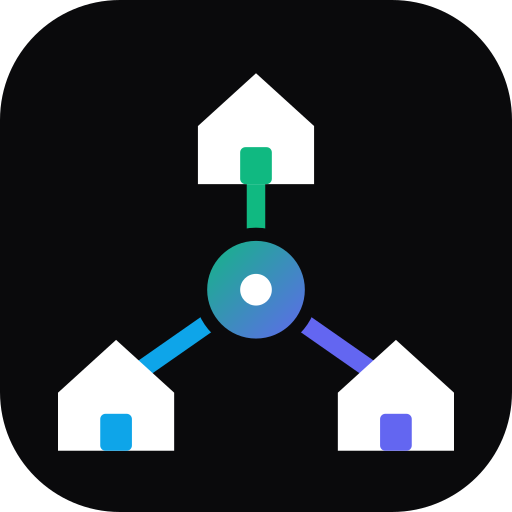
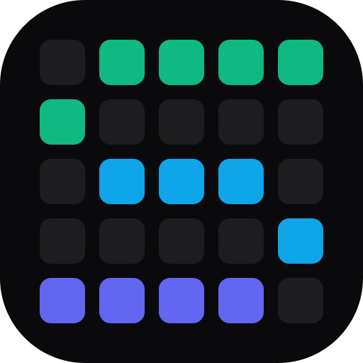
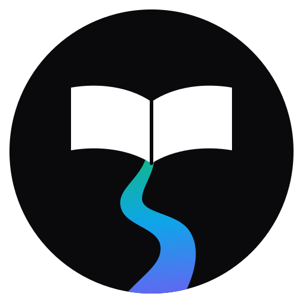
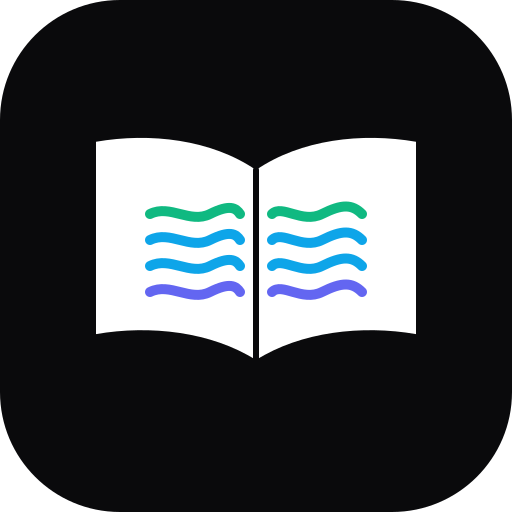
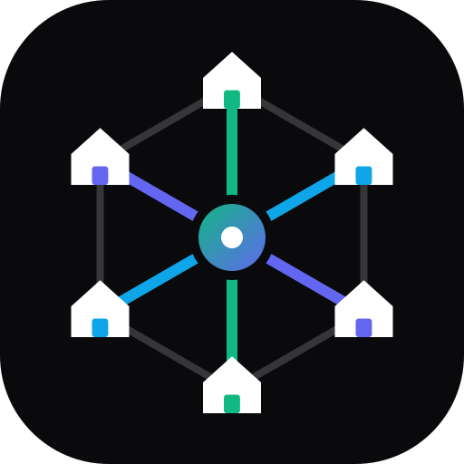
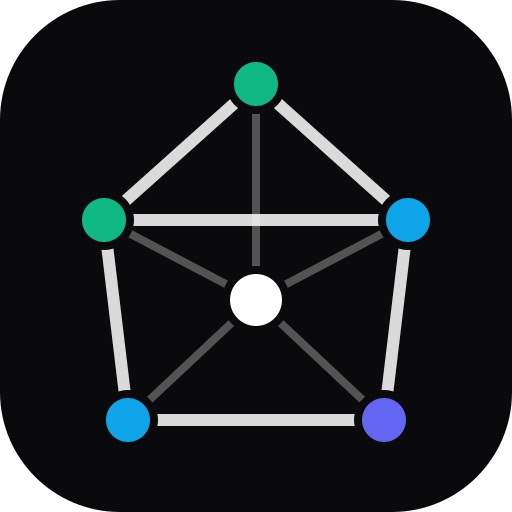
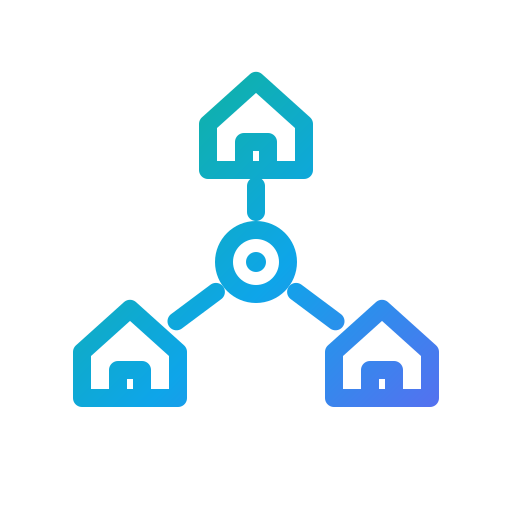
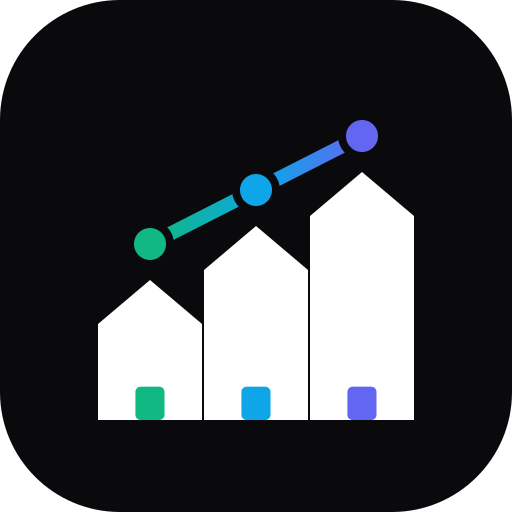
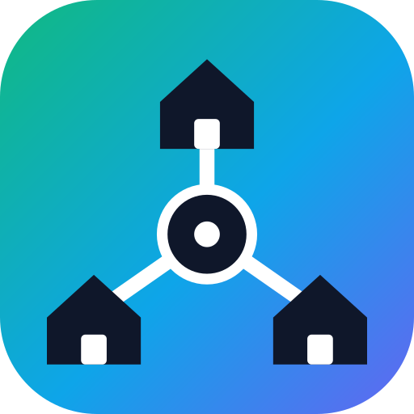

# Logo do Sistema Escolar

A logo é do **sistema**, não de uma escola: a plataforma atende várias escolas,
então nem o desenho nem o nome dos arquivos citam uma escola específica.

## Em uso

**Livro e rio** — um livro aberto do qual nasce um rio: o conhecimento que flui.
Escolhida na Issue #460 e aplicada na Issue #461.

| Arquivo | Uso |
|---|---|
| `img/logo.svg` | Fonte canônica. Splash, login, landing e favicon |
| `img/logo.png` | 512×512, render do SVG. Entrada do `scripts/generate-pwa-icons.py` |
| `img/icons/*.png` | Ícones do PWA, gerados pelo script acima |
| `favicon/`, `favicon.svg` | Favicon |

Para trocar a logo: edite `img/logo.svg`, gere `img/logo.png` (512×512, fundo
transparente), rode `python scripts/generate-pwa-icons.py`, copie
`img/icons/icon-512.png` para `portal-responsavel/public/icon-512.png` e suba o
`VERSION` do `service-worker.js`.

## Propostas avaliadas

Ficam aqui como histórico da escolha. Não são servidas pelo site.

### Primeira rodada

| | | | |
|:-:|:-:|:-:|:-:|
|  01 · Cubo com capelo |  02 · Monograma S |  03 · Escolas em rede |  04 · Livro e progresso |
|  05 · Brasão |  06 · S em blocos |  07 · Selo | |

### Variações de Livro e rio

| | | | |
|:-:|:-:|:-:|:-:|
|  **L1 · Original (escolhida)** |  L2 · Sobre gradiente |  L3 · Nascente |  L4 · Amanhecer |
|  L5 · Páginas de água |  L6 · Traço |  L7 · Selo | |

### Variações de Escolas em rede

| | | | |
|:-:|:-:|:-:|:-:|
|  R1 · Seis escolas |  R2 · Escola de conexões |  R3 · Órbita |  R4 · Capelo no centro |
|  R5 · Traço |  R6 · Rede em crescimento |  R7 · Sobre gradiente | |
